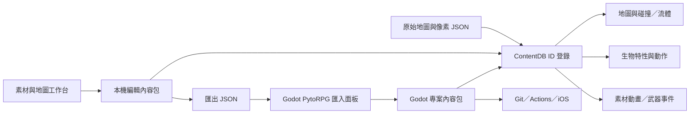

最新版本：[Phase6 修正與 iPhone 打包](Phase6修正與iPhone打包.md)。

# Godot 開發與內容包

## 資料與執行邊界

`data/maps`、`data/creatures.json`、`data/weapons.json` 與 `assets/pixel_sources` 保留轉換來源。`content_db.gd` 統一解析 `maps/assets/creatures/weapons/actions/custom` 六個 ID 表。覆蓋順序是原始資料 → `res://data/content_pack.json` → `user://content_pack.json`。

遊戲存檔只處理進行狀態：生命、背包、穿戴、已開寶箱、角色位置、採集與流動後的地形／液體。編輯內容包處理世界設計與素材定義；不要把兩者混成一份存檔。

## 編輯一條完整關聯

1. 開啟素材工作台，選 `creature.wolf`，修改像素、生命或動作範圍。
2. 修改 attack 動畫的 action 事件；已支援動作會在此影格執行效果。正常停止的蹲姿片段不會被自動重新播放。
3. 儲存套用，或複製為 `creature.my_wolf`。新 ID 同時獲得對應特性與動作資料。
4. 進入地圖工作台，選「放置生物／魔物」並放置新 ID。保存地圖。
5. 素材工作台匯出內容包，再從 Godot 的 PytoRPG dock 匯入。專案 JSON 可直接納入 Git diff。
6. 在乾淨使用者資料區執行 F5／自動測試，再使用原 Windows／iOS workflow。

原有 Windows 的 user 資料位置通常是 `%APPDATA%/Godot/app_userdata/PytoRPG Godot Migration/`。本開發測試使用工作目錄下的隔離 APPDATA，不會把測試內容混入使用者正常存檔。

## 主要 GDScript 模組

| 檔案 | 責任 |
|---|---|
| content_db / content_validate | 原資料、內容包合併、像素來源、原子保存、匯入檢查 |
| asset_workbench / pixel_canvas | 像素、動畫、事件、特性、動作及自訂素材編輯 |
| map_workbench / map_grid | 地圖畫筆、放置、復原／重做、關聯地圖保存 |
| world / scenery / background | 前景碰撞、材質背牆、自訂動畫物件、遠景 |
| liquids | 活動區液體、部分圖塊容量、接觸／呼吸／燃燒與冷卻 |
| inventory_model / inventory_ui | 72 格權威背包、逐把重擊次數、穿戴、分堆、丟棄／放置 |
| gameplay / creature_actions | 戰鬥、事件時序、掉落、跨世界狀態、已支援怪物動作 |
| weapon_view | 原 FIX54 圖元及使用者編輯的特效動畫 |
| tools | 分層採集、鉤爪；保持背景與地形變更分離 |
| addons/pytorpg_content | Godot 編輯器內容包匯入面板 |

原 FIX54 特效由 `tools/import_weapon_vfx.py` 擷取原渲染程式的指定純圖元區段，取 61 個進度樣本生成 `data/weapon_vfx.json`。不在遊戲內執行 Python、UIKit 或 Metal。修改 GDScript 渲染及匯入器後要同步更新對照測試。

## 驗證

Godot 4.5.1：先 `--headless --editor --import --quit`，再分別執行 `--headless --quit-after 1800 --script res://tests/smoke.gd`、`gameplay.gd`、`phase3.gd`、`phase4.gd`。成功標記外仍需檢查 `SCRIPT ERROR`，不能只看程序 exit code。

Godot dock 合併內容包之前會檢查 schema、像素矩陣／色碼、影格、FPS 與圖塊邊界；不是任意腳本載入器。圖片與動畫來源保留在發行包，讓未來 iOS 版也能繼續编辑，再匯出回 Windows。

## Phase5 執行模組

`action_controller.gd` 是 J 的單一擁有者，將動作派往 tools／magic／gameplay。`aim_pad.gd` 單独追蹤觸控指標，與移動、動作按鈕可以同時使用。釋放射擊時保存瞄準向量，之後的動畫事件不重新讀取游標，換模式則取消尚未完成的蓄力。

`weapon_projectiles.gd` 負責有限數量的投射物與逐段掃掠碰撞；`projectile_vfx.gd` 對照原 Metal 圖元畫出核心及飛行軌跡。`source_vfx.gd` 是共用的素材影格入口，內容版本變更會清除影格快取。

`boss_combat.gd` 使用 `data/boss_choreography.json` 的原命中形狀，按 simulation delta 逐一消耗節拍。`effect.<武器>_heavy` 的 `animations.effect.frame_events.<影格>.damage` 可覆蓋時間；工作台的新勾選框就是此欄位。動作 effect_asset 與專案內容包共用，沒有第二份硬編碼素材庫。`environment.gd` 保存局部凍結水量、燃燒植物及蒸發記帳；完整熱模擬仍要往此模組擴充。

來源重建工具：`tools/import_phase5.py` 讀取原常數與採集表；`tools/import_boss_choreography.py` 只抽取原 FIX116 的純幾何方法生成六種招式資料；`tools/build_control_lab.py` 產生額外試驗場。這些工具在開發時執行，App 執行時不需要 Python。匯入原資料後若覆寫了 weapons.json，必須重新執行 Boss 匯入器。

CI 的 check／Windows／iOS workflow 已加入 Phase5。物理測試用固定 60 FPS 與結束標記確認，避免高速 headless 主迴圈先到達 quit-after 卻沒跑完整物理測試。遠端 workflow 與真機結果仍須實際運行才可確認。
