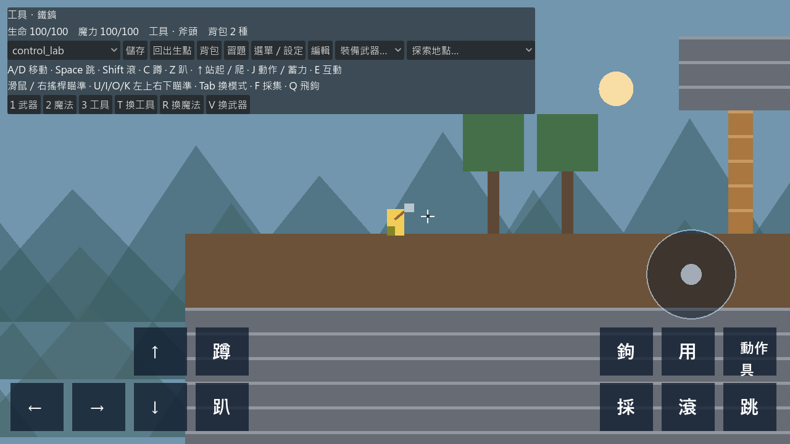
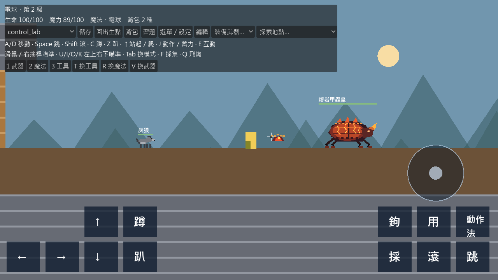

# Phase5：完成內容、依據與差異

這份文件區分「本版可操作」、「原碼已對照」與「仍未等價」。原 FIX131 全專案、像素來源與九個世界都保留在 reference／assets／data。不能以能開啟或測試通過推論全部原版功能已移植。

## 本次五項回報

| 回報 | 本版結果 | 原碼依據與界線 |
|---|---|---|
| 工具無切換鍵、無法砍樹／挖洞／飛鉤 | 1／2／3 模式、T 工具循環、上方 GUI 與 J 共用動作；F／Q 保留快捷；砍除植物、材質硬度、原掉落 ID、飛鉤狀態及跨圖存檔 | ToolSystem 原順序為 pickaxe／axe／grapple；硬度、材質組及掉落表由 AST 讀取；水平整格、垂直分層、整格挖完才產生材料。巨大雨林樹支撐子樹崩塌、土層含水釋放與壓力空氣尚未完整搬移。鉤爪已用 9 格射程、920 飛行、1180 收回、235 收繩、2350 拉力及 520 上限；梯藤等所有特殊附著規則、完整擺盪約束尚有差異。 |
| 蹲走停止先站再蹲 | 從 crouch_run／crouch_walk 回到 crouch 時直接停在最後影格；按 ↑ 才嘗試站起 | 保留原蹲下過渡動畫供真正進入蹲姿使用；連續 40 個物理影格驗證停止時無站姿重播。 |
| 弓只能平射 | 滑鼠、鍵盤 U/I/O/K／數字鍵盤與專用多點觸控搖桿；在釋放時鎖定方向，動作影格稍後產生射擊 | 原準心固定 1.35 格，只代表方向。能量弓普攻、雷射、火箭等使用瞄準向量；弓重擊依原規則先向上射，再受重力形成箭雨。 |
| 魔法及三種動作切換缺失 | 火／水／冰／電、原蓄力閾值、耗魔、回魔、速度／重力／壽命、傷害、冰緩速／電暈；切模式取消舊蓄力，放開不誤射 | 原 MagicSystem 以 6 格虛擬目標補償彈道。第 3 級火／水分成六個第 1 級碎片。本版有水量、凍結／融冰、蒸發記帳、局部水導電與植物燃燒；未完成原大氣水分、熱量／電荷／毒氣的完整守恆網路。 |
| 魔物／Boss／武器攻擊特效遵循原版 | 原動作事件、獨立特效事件、外部 effect_asset、原像素動畫、世界座標特效、分段 delay／clip、主要程序式投射物圖元與軌跡；六個 FIX103 家族和獎勵武器共用命中形狀與節拍 | FIX116 純幾何函式直接產生資料；Boss 特效 frame_events.damage 覆蓋預設時間。碰撞、節拍和多種原圖元已移植，但所有 presentation profile、像素密度規則、錨點工具與招式視覺仍未逐幀全等。 |

## 武器與首領

可選武器共 20 種：原先八種，加上雷射槍、溜溜球、戰鬥陀螺、RPG 火箭筒、TNT、飛行無人機，再加熔核戰錘、九尾冰扇、深海巨鉗、雷神長弓、地脈鑽槍、世界樹權杖。這是本版支援清單，不等於原版全部獎勵武器。

- 雷射保留反射、穿透不同目標和重击扇射；溜溜球保留出擊／回收／重擊繞行；陀螺保留彈跳；火箭／TNT 有爆炸，TNT 有局部地形破壞；無人機有按鍵出擊、尋找目標、返回與重擊自爆。無人機完整自動伴飛控制／原多機群仍未等價。
- 六個 FIX103 首領：熔岩甲蟲皇、冰晶九尾狐、深海巨螯蟹王、雷霆巨鷹、地底鑽岩巨蟲、古樹魔神；原 36 個重擊節拍與各子區域傷害倍率由原碼匯出。擊倒後掉落對應獎勵武器。
- 巨蟒甩尾／移動增高龍捲風、金剛連拳、三頭龍九發元素吐息，以及種子／風三連射已有執行分支。這些分支仍需更多原地圖實戰與特殊情境驗收；不能當作完整 Boss AI。
- 武器爆炸採原程序式像素環的相容呈現；自訂投射物核心仍讀取素材動畫。原所有 VFX profile、死亡動畫與物件音效尚未全部一致。
- 普通武器用盡仍沿用出生點回收掉落；完整原回收寶箱沒有完成。無人機重擊的消耗品語意與原資料一致，不產生回收副本。

## 已驗證

Windows／Godot 4.5.1：smoke、gameplay、Phase3、Phase4、Phase5 全部通過。日誌另檢查 SCRIPT ERROR／ERROR；此機器單一系統根憑證讀取訊息與遊戲腳本無關。

Phase5 包含：鍵盤映射、模式選取、T／R 切換、蹲走停止、砍樹掉落、挖洞與硬度、飛鉤附著與換模式解除、斜向射擊及釋放方向鎖定、換模式取消蓄力、四種魔法與缺魔拒絕、冰傷害與緩速、凍結／融冰水量、六種新增投射物的生命週期、雷射薄牆反射、六個 Boss 時間表跨越多節拍不漏／不重複、原綁定素材、三頭吐息數量、砍樹跨圖保存、編輯器傷害影格到執行時間表、多點觸控準心擁有者。

原資料對照：9 個原世界、117,639 個地形格保持一致。加上獨立試驗場，共 481 個生物放置引用；222 個動畫資產與 240 題注音引用驗證通過。

已跑實際 OpenGL 畫面與啟用生物動作的物理迴圈；截圖：

## 尚未宣稱完成

1. 原全部 Boss／獎勵武器、完整生物生態、所有招式碰撞與動畫逐幀等價。
2. 素材編輯器的全部筆刷、圖片縮放匯入、骨架／錨點與攻擊＋VFX 合成預覽；地圖產生器、全部機關／寶箱／傳送門專用編輯 UI。
3. 熱量、蒸汽、大氣、降雨、滲透、土層含水、電荷／毒氣和植物生態的完整耦合。現有 environment.gd 只是一組有保存狀態的局部反應，不能稱原完整熱流體模擬。
4. Pyto v19 舊存檔完整遷移、原音效、獨立 iOS App 的安裝／更新／觸控／效能真機驗收。此版只驗證既有 Godot 存檔的延續。

另更正先前「合成」的描述：目前對原碼搜尋，只找到素材編輯器的「攻擊＋VFX 合成預覽」，沒有找到物品合成配方表或 crafting 系統。不能把未找到的原版配方宣称為已移植，也沒有擅自發明一套配方冒充原玩法。
